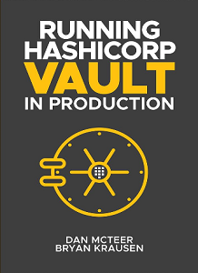

## HashiCorp-related training courses, projects, and book

This repo is intended to supplement training courses and external projects related to HashiCorp training and community-based engagement. It is not affiliated with HashiCorp and should not be treated as such. Content shared here is targeted for students looking for additional content or content referenced in material created for educational purposes.

Check out my profile on GitHub at [btk.me/btk](btk.me/btk)

*********************************************************************************

### Buy my book on Amazon:

[Running HashiCorp Vault in Production](https://amzn.to/2UeUjAI)

### Buy my book on Gumroad in PDF format:

[Running HashiCorp Vault in Production](https://gum.co/vaultbook/)

<a href="https://amzn.to/2UeUjAI"> 

 
### Current Training Discounts and Coupons

####

[Udemy Profile for Bryan Krausen](https://www.udemy.com/user/bryan-krausen/ "Udemy Profile")

| No  | Course Link | Coupon Code | Valid Until |
| --- | ----------- | ----------- | ----------- |
| 1 | [Getting Started with HashiCorp Vault](https://btk.me/v) | APR2023 | May 1, 2023 |
| 2 | [HashiCorp Vault: The Advanced Course](https://btk.me/va) | APR2023 | May 1, 2023 |
| 3 | [Integrating HashiCorp Vault with AWS](https://btk.me/vaws) | APR2023 | May 1, 2023 |
| 4 | [HashiCorp Certified: Vault Operations Professional](https://btk.me/vp) | APR2023 | May 1, 2023 |
| 5 | [Mastering Terraform Cloud with Hands-On Labs](https://btk.me/tfc) | APR2023 | May 1, 2023 |
| 6 | [HashiCorp Certified: Terraform Associate Hands-On Lab Course](https://btk.me/tfhol) | APR2023 | May 1, 2023 |
| 7 | [HashiCorp Certified: Terraform Associate Practice Exam](https://btk.me/tf) | APR2023 | May 1, 2023 |
| 8 | [HashiCorp Certified: Vault Associate Practice Exam](https://btk.me/vpe) | APR2023 | May 1, 2023 |
| 9 | [HashiCorp Certified: Consul Associate Practice Exam](https://btk.me/cpe) | APR2023 | May 1, 2023 |
| 10 | [Getting Started with HashiCorp Consul](https://btk.me/c) | APR2023 | May 1, 2023 |
| 11 | [Building Automated Machine Images using HashiCorp Packer](https://btk.me/p) | APR2023 | May 1, 2023 |
| 12 | [HashiCorp Nomad Fundamentals: The Ultimate Beginner's Guide](https://btk.me/n) | APR2023 | May 1, 2023 |

Please feel free to reach through [Twitter](https://twitter.com/btkrausen) or [LinkedIn](https://www.linkedin.com/in/bryan-krausen-5ab8794/) for questions or comments.
