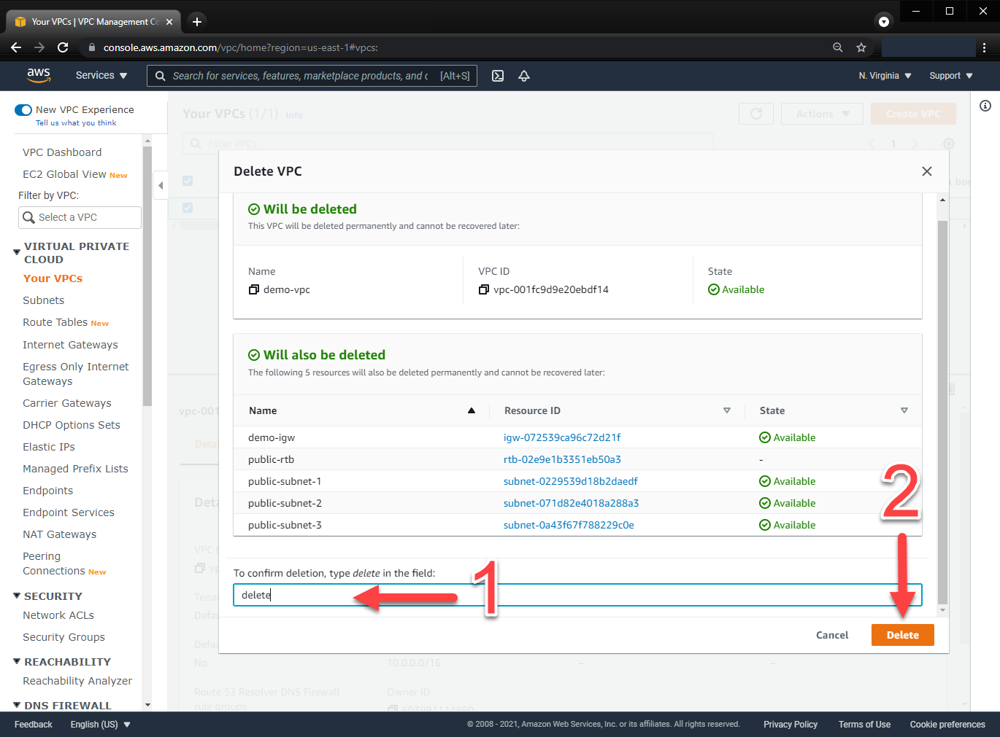

# Lab: Benefits of IaC

## Benefits of IaC

While there are many benefits of Infrastructure as Code, a few key benefits include the simplification of cloud adoption, allowing us to quickly adopt cloud-based services and offerings to improve our capabilities. Infrastructure as Code allows us to remove many of the manual steps required today for infrastructure requests, giving us the ability to automate approved requests without worrying about tickets sitting in a queue. We can also use Infrastructure as Code to provide capacity on-demand by offering a library of services for our developers, even publishing a self-service capability where developers and application owners can be empowered to request and provision infrastructure that better matches their requirements. Again, all of this is possible while driving standardization and consistency throughout the organization, which can drive efficiencies and reduce errors or deviations from established norms.

References

[Infrastructure as Code in a Private or Public Cloud](https://www.hashicorp.com/blog/infrastructure-as-code-in-a-private-or-public-cloud)

# Lab Instructions

You have been tasked with deploying some basic infrastructure on AWS to host a proof of concept environment. The architecture needs to include both public and private subnets and span multiple Availability Zones to test failover and disaster recovery scenarios. You expect to host Internet-facing applications. Additionally, you have other applications that need to access the Internet to retrieve security and operating system updates.

- **Task 1:** Create a new VPC in your account in the US-East-1 region
- **Task 2:** Create public and private subnets in three different Availability Zones
- **Task 3:** Deploy an Internet Gateway and attach it to the VPC
- **Task 4:** Provision a NAT Gateway (a single instance will do) for outbound connectivity
- **Task 5:** Ensure that route tables are configured to properly route traffic based on the requirements
- **Task 6:** Delete the VPC resources
- **Task 7:** Prepare files and credentials for using Terraform to deploy cloud resources
- **Task 8:** Set credentials for Terraform deployment
- **Task 9:** Deploy the AWS infrastructure using Terraform
- **Task 10:** Delete the AWS resources using Terraform to clean up our AWS environment

The end state of the AWS environment should look similar to the following diagram:


> _This lab will walk you through configuring the infrastructure step by step using a manual process. After manually completing the tasks, the lab will show you how Terraform can be used to automate the creation of the same infrastructure._

## Task 1: Log into the AWS Console and create a VPC.

### **Step 1.1**

In the VPC console, click **Create VPC**:


### **Step 1.2**

Give the VPC a name of **demo-vpc** and set the IPv4 CIDR block to use **10.0.0.0/16**. Leave all of the other settings as default and select **Create VPC** at the bottom of the Create VPC screen.


## Task 2: Create public and private subnets in three different Availability Zones.

### **Step 2.1**

In the VPC console, select **_Subnets_** from the left navigation panel. Click **Create Subnet**.


### **Step 2.2**

Select the VPC created in Step 1 from the dropdown list. Give the subnet the name `private-subnet-1` and select `us-east-1a` from the dropdown list for the Availability Zone. Enter the IPv4 CIDR block of `10.0.0.0/24`.


### **Step 2.3**

Repeat the previous step to create the additional subnets required to build out the required infrastructure, including 2 additional private subnets and the 3 public subnets. Use the following information to complete this step:

|   Subnet Name    | Availability Zone |  CIDR Block   |
| :--------------: | :---------------: | :-----------: |
| private-subnet-2 |    us-east-1b     |  10.0.1.0/24  |
| private-subnet-3 |    us-east-1c     |  10.0.2.0/24  |
| public-subnet-1  |    us-east-1a     | 10.0.100.0/24 |
| public-subnet-2  |    us-east-1b     | 10.0.101.0/24 |
| public-subnet-3  |    us-east-1c     | 10.0.102.0/24 |

## Task 3: Deploy an Internet Gateway and attach it to the VPC.

### **Step 3.1**

In the VPC console, select Internet Gateways from the left navigation panel in the VPC console. Click the Create Gateway button in the top right of the AWS console.


### **Step 3.2**

Give the new Internet Gateway a name of **_demo-igw_** and click the Create internet gateway button.

> _Note: The Internet Gateway can incur charges on your account. For the purposes of this lab, you will incur very minimal charges, likely a penny or two (US dollars). Don't fret...we will delete this resource shortly._


### **Step 3.3**

In the Internet Gateway console, select the Actions menu and choose **_Attach to VPC_** from the dropdown list.


Select the VPC created in Step 1 by clicking the text box and choosing the VPC. Click the **_Attach internet gateway_** button to complete the task.


## Task 4: Provision a NAT Gateway (a single instance will do) for outbound connectivity.

### **Step 4.1**

Back in the VPC Console, select **NAT Gateways** from the left navigation panel. Click the **_Create NAT Gateway_** button on the top right of the AWS console.


### **Step 4.2**

Provide the name **_demo-nat-gateway_** for the NAT Gateway. Select a subnet by choosing **_public-subnet-2_** from the dropdown list. Keep the Connectivity Type as **_Public_**. Click the **_Allocate Elastic IP_** button to automatically create and assign a new Elastic IP address for the NAT Gateway. Scroll down and click the **_Create NAT Gateway_** button to complete the task.


## Task 5: Ensure that route tables are configured to properly route traffic based on the requirements.

### **Step 5.1**

In the VPC console, select **Route Tables** from the left navigation panel. Click the **_Create route table_** button on the top right of the AWS console.

Provide the name `public-rtb` for the route table and select the VPC created in Step 1. Click the **_Create route table_** button to create your first route table.


Repeat the above task to create a second route table. Name the second route table `private-rtb`. Select the same VPC created in Step 1. Click the **_Create route table_** button to create the second route table.

### **Step 5.2**

From the Route Tables console, select the tick box next to the route table named `public-rtb`. In the bottom panel, select the **_Subnet Associations_** tab. Click the **_Edit subnet associations_** button.


Select the three **_public_** subnets from the list of available subnets by checking the tick box next to the subnets. These are the same three subnets that you created in Step 2. Once you have selected the three subnets, click on the **_Save associations_** button to save your configuration.

Repeat this step for the `private-rtb` and selecting the 3 private subnets that were created in Step 2.


### **Step 5.3**

Now that the subnets have been associated with the proper route table, we need to add the routes to ensure network traffic is routed correctly. From the Route Tables console, select the `public-rtb` again. In the bottom pane, select the **Routes** tab and click **_Edit Routes_**.


In the Edit Routes window, click the **_Add route_** button. Enter `0.0.0.0/0` in the **Destination** text box to define our new route destination. Click the text box for **Target**, select **_Internet Gateway_**, and select the Internet Gateway that was created in Step 3. It should be the only one listed. Click **_Save changes_** to save the new route configuration.


Repeat this step to add a route to the `private-rtb`. The Destination should be `0.0.0.0/0`. Click the text box for **Target**, select **_NAT Gateway_**, and choose the NAT Gateway that was created in Step 4. It should be the only one listed. Click **_Save changes_** to save the new route configuration.

---

### **Congratulations, you have manually configured all of the resources and have an environment that now matches the desired configuration as stated by the requirements.**

---

Wasn't that fun? While this example given in the lab isn't too bad, how would you feel repeating this process across 10s or 100s of AWS accounts in your organization? It would be extremely time-consuming and a very monotonous task. Additionally, how confident would you be to repeat these tasks over and over without making a mistake that could impact production or the security of your infrastructure? That's where Infrastructure as Code (IaC) comes into the picture.

IaC allows us to easily replicate deployment tasks and take the human aspect out of repetitive tasks. By codifying your infrastructure, you can reduce or eliminate risks to the infrastructure running your applications. IaC makes changes idempotent, consistent, repeatable, and predictable. Plus, you can easily see how any modifications to your environment will impact your infrastructure before ever applying it.

Well, as much fun as that was, it's time to delete all of the resources that we just created. Note that normally you would need to delete the resources in a certain order since many of the resources are dependant on others. However, the VPC is unique in that you can delete the VPC and it will delete all associated resources if there aren't any other dependencies.

As you are deleting resources, note that manually deleting resources is sometimes risky, especially on a public cloud where forgotten resources could rack up a large bill. Additionally, leaving behind technical debt can impact future deployments and cause confusion when deploying future workloads.

## Task 6: Delete the VPC resources.

### **Step 6.1**

Prior to deleting the VPC, you must first delete the NAT gateway. Select NAT Gateways on the left navigation pane and delete the **_demo-nat-gateway_**. Afterwards, in the VPC Console, select the VPC that we just created by checking the tick box next to the VPC. From the Actions menu, select **_Delete VPC_**. Confirm you wish to delete the VPC and related AWS resources by typing _delete_ in the text box at the bottom of the prompt. Click the **_Delete_** button.



## Task 7: Prepare files and credentials for using Terraform to deploy cloud resources.

### **Step 7.1**

On your workstation, navigate to the `/workstation/terraform` directory. This is where we'll do all of our work for this training. Create a new file called `main.tf` and `variables.tf`.

In the `variables.tf`, copy the following variable definitions and save the file. Don't worry about understanding everything just yet, we'll learn all about variables in Objective 3.

```hcl
variable "aws_region" {
  type    = string
  default = "us-east-1"
}

variable "vpc_name" {
  type    = string
  default = "demo_vpc"
}

variable "vpc_cidr" {
  type    = string
  default = "10.0.0.0/16"
}

variable "private_subnets" {
  default = {
    "private_subnet_1" = 1
    "private_subnet_2" = 2
    "private_subnet_3" = 3
  }
}

variable "public_subnets" {
  default = {
    "public_subnet_1" = 1
    "public_subnet_2" = 2
    "public_subnet_3" = 3
  }
}
```

In the `main.tf` file, copy the following Terraform configuration and save the file.

```hcl
# Configure the AWS Provider
provider "aws" {
  region = "us-east-1"
}

#Retrieve the list of AZs in the current AWS region
data "aws_availability_zones" "available" {}
data "aws_region" "current" {}

#Define the VPC
resource "aws_vpc" "vpc" {
  cidr_block = var.vpc_cidr

  tags = {
    Name        = var.vpc_name
    Environment = "demo_environment"
    Terraform   = "true"
  }
}

#Deploy the private subnets
resource "aws_subnet" "private_subnets" {
  for_each          = var.private_subnets
  vpc_id            = aws_vpc.vpc.id
  cidr_block        = cidrsubnet(var.vpc_cidr, 8, each.value)
  availability_zone = tolist(data.aws_availability_zones.available.names)[each.value]

  tags = {
    Name      = each.key
    Terraform = "true"
  }
}

#Deploy the public subnets
resource "aws_subnet" "public_subnets" {
  for_each                = var.public_subnets
  vpc_id                  = aws_vpc.vpc.id
  cidr_block              = cidrsubnet(var.vpc_cidr, 8, each.value + 100)
  availability_zone       = tolist(data.aws_availability_zones.available.names)[each.value]
  map_public_ip_on_launch = true

  tags = {
    Name      = each.key
    Terraform = "true"
  }
}

#Create route tables for public and private subnets
resource "aws_route_table" "public_route_table" {
  vpc_id = aws_vpc.vpc.id

  route {
    cidr_block     = "0.0.0.0/0"
    gateway_id     = aws_internet_gateway.internet_gateway.id
    #nat_gateway_id = aws_nat_gateway.nat_gateway.id
  }
  tags = {
    Name      = "demo_public_rtb"
    Terraform = "true"
  }
}

resource "aws_route_table" "private_route_table" {
  vpc_id = aws_vpc.vpc.id

  route {
    cidr_block     = "0.0.0.0/0"
    # gateway_id     = aws_internet_gateway.internet_gateway.id
    nat_gateway_id = aws_nat_gateway.nat_gateway.id
  }
  tags = {
    Name      = "demo_private_rtb"
    Terraform = "true"
  }
}

#Create route table associations
resource "aws_route_table_association" "public" {
  depends_on     = [aws_subnet.public_subnets]
  route_table_id = aws_route_table.public_route_table.id
  for_each       = aws_subnet.public_subnets
  subnet_id      = each.value.id
}

resource "aws_route_table_association" "private" {
  depends_on     = [aws_subnet.private_subnets]
  route_table_id = aws_route_table.private_route_table.id
  for_each       = aws_subnet.private_subnets
  subnet_id      = each.value.id
}

#Create Internet Gateway
resource "aws_internet_gateway" "internet_gateway" {
  vpc_id = aws_vpc.vpc.id
  tags = {
    Name = "demo_igw"
  }
}

#Create EIP for NAT Gateway
resource "aws_eip" "nat_gateway_eip" {
  domain     = "vpc"
  depends_on = [aws_internet_gateway.internet_gateway]
  tags = {
    Name = "demo_igw_eip"
  }
}

#Create NAT Gateway
resource "aws_nat_gateway" "nat_gateway" {
  depends_on    = [aws_subnet.public_subnets]
  allocation_id = aws_eip.nat_gateway_eip.id
  subnet_id     = aws_subnet.public_subnets["public_subnet_1"].id
  tags = {
    Name = "demo_nat_gateway"
  }
}
```

## Task 8: Set credentials for Terraform deployment

### **Step 8.1**

Now that we have our Terraform files ready to go, the last step we need to complete is setting a few environment variables to set our AWS credentials and region used by Terraform. In AWS, generate an access key and secret key from an IAM user with Administrative privileges. If you need help, [check out this link with a walk-through](https://aws.amazon.com/premiumsupport/knowledge-center/create-access-key/).

Once you have credentials, set the following environment variables for Linux, MacOS, or Bash on Windows:

```shell
export AWS_ACCESS_KEY_ID="<YOUR ACCESS KEY>"
export AWS_SECRET_ACCESS_KEY="<YOUR SECRET KEY>"
```

If you're running PowerShell on Windows, you'll need to use the following to set your AWS credentials:
```shell
PS C:\> $Env:AWS_ACCESS_KEY_ID="<YOUR ACCESS KEY>"
PS C:\> $Env:AWS_SECRET_ACCESS_KEY="<YOUR SECRET KEY>"
```

If you're using the default Windows command prompt, you can use the following to set your AWS credentials:
```shell
C:\> setx AWS_ACCESS_KEY_ID <YOUR ACCESS KEY>
C:\> setx AWS_SECRET_ACCESS_KEY <YOUR SECRET KEY>
```

[More information on setting credentials for AWS can be found here](https://docs.aws.amazon.com/cli/latest/userguide/cli-configure-envvars.html)

## Task 9: Deploy the AWS infrastructure using Terraform

### **Step 9.1**

The first step to using Terraform is initializing the working directory. In your shell session, type the following command:

```shell
terraform init
```

As a response, you should see something like the following output (note that the provider version might change):

```shell
terraform init

Initializing the backend...

Initializing provider plugins...
- Checking for available provider plugins...
- Downloading plugin for provider "aws" (hashicorp/aws) 3.37.0...

Terraform has been successfully initialized!

You may now begin working with Terraform. Try running "terraform plan" to see
any changes that are required for your infrastructure. All Terraform commands
should now work.

If you ever set or change modules or backend configuration for Terraform,
rerun this command to reinitialize your working directory. If you forget, other
commands will detect it and remind you to do so if necessary.
```

### **Step 9.2**

Now that our working directory is initialized, we can create a plan for execution. This will provide a preview of the changes to our AWS environment. To create a plan, execute the following command:

```shell
terraform plan
```

You should see an output similar to the one below. Note that the example below has been truncated for the sake of brevity:

```shell
Refreshing Terraform state in-memory prior to plan...
The refreshed state will be used to calculate this plan, but will not be
persisted to local or remote state storage.

data.aws_region.current: Refreshing state...
data.aws_availability_zones.available: Refreshing state...

------------------------------------------------------------------------

An execution plan has been generated and is shown below.
Resource actions are indicated with the following symbols:
  + create

Terraform will perform the following actions:

  # aws_eip.nat_gateway_eip will be created
  + resource "aws_eip" "nat_gateway_eip" {
      + allocation_id        = (known after apply)
      + association_id       = (known after apply)
      + carrier_ip           = (known after apply)
      + customer_owned_ip    = (known after apply)
      + domain               = (known after apply)
      + id                   = (known after apply)
      + instance             = (known after apply)
      + network_border_group = (known after apply)
      + network_interface    = (known after apply)
      + private_dns          = (known after apply)
      + private_ip           = (known after apply)
      + public_dns           = (known after apply)
      + public_ip            = (known after apply)
      + public_ipv4_pool     = (known after apply)
      + tags                 = {
          + "Name" = "demo_igw_eip"
        }
      + vpc                  = true
    }
...

Plan: 18 to add, 0 to change, 0 to destroy.

------------------------------------------------------------------------

Note: You didn't specify an "-out" parameter to save this plan, so Terraform
can't guarantee that exactly these actions will be performed if
"terraform apply" is subsequently run.
```

Notice that Terraform will create 18 resources for us in our AWS environment, which includes all of the networking components we manually created in earlier steps.

### **Step 9.3**

For our final step to create our AWS resources, we need to apply the configuration. An apply will instruct Terraform to create the resources in AWS that are defined in our configuration file(s). And as we saw in our plan, it will create 18 resources for us. To execute the Terraform, run the following command:

```shell
terraform apply -auto-approve
```

> Note that we are using the -auto-approve flag for simplicity. You can leave it out, validate the changes to the environment, and type `yes` to validate you want to apply the configuration.

After running the above command, you should see output similar to the following:

```shell
data.aws_region.current: Refreshing state...
data.aws_availability_zones.available: Refreshing state...

An execution plan has been generated and is shown below.
Resource actions are indicated with the following symbols:
  + create

Terraform will perform the following actions:

  # aws_eip.nat_gateway_eip will be created
  + resource "aws_eip" "nat_gateway_eip" {
      + allocation_id        = (known after apply)
      + association_id       = (known after apply)
      + carrier_ip           = (known after apply)
      + customer_owned_ip    = (known after apply)
      + domain               = (known after apply)
      + id                   = (known after apply)
      + instance             = (known after apply)
      + network_border_group = (known after apply)
      + network_interface    = (known after apply)
      + private_dns          = (known after apply)
      + private_ip           = (known after apply)
      + public_dns           = (known after apply)
      + public_ip            = (known after apply)
      + public_ipv4_pool     = (known after apply)
      + tags                 = {
          + "Name" = "demo_igw_eip"
        }
      + vpc                  = true
    }
...
aws_vpc.vpc: Creating...
aws_vpc.vpc: Still creating... [10s elapsed]
aws_vpc.vpc: Creation complete after 11s [id=vpc-05bf9e6a14d8ee736]
aws_subnet.private_subnets["private_subnet_2"]: Creating...
aws_subnet.public_subnets["public_subnet_3"]: Creating...
aws_internet_gateway.internet_gateway: Creating...
aws_subnet.public_subnets["public_subnet_1"]: Creating...
aws_subnet.private_subnets["private_subnet_1"]: Creating...
aws_subnet.public_subnets["public_subnet_2"]: Creating...
aws_subnet.private_subnets["private_subnet_3"]: Creating...
aws_subnet.private_subnets["private_subnet_3"]: Creation complete after 2s [id=subnet-097ce13a4cd397b92]
aws_subnet.private_subnets["private_subnet_2"]: Creation complete after 2s [id=subnet-0e13dbad1bdcc9b3d]
aws_internet_gateway.internet_gateway: Creation complete after 3s [id=igw-09460c69ff2efdaa7]
aws_eip.nat_gateway_eip: Creating...
aws_route_table.public_route_table: Creating...
aws_subnet.private_subnets["private_subnet_1"]: Creation complete after 3s [id=subnet-0cd287fb292ad3720]
aws_eip.nat_gateway_eip: Creation complete after 1s [id=eipalloc-0834ec4c7cb0ff0d1]
aws_route_table.public_route_table: Creation complete after 2s [id=rtb-0f354a5a7facfe6f1]
aws_subnet.public_subnets["public_subnet_1"]: Still creating... [10s elapsed]
aws_subnet.public_subnets["public_subnet_2"]: Still creating... [10s elapsed]
aws_subnet.public_subnets["public_subnet_3"]: Still creating... [10s elapsed]
aws_subnet.public_subnets["public_subnet_3"]: Creation complete after 13s [id=subnet-09b2418caea54512e]
aws_subnet.public_subnets["public_subnet_2"]: Creation complete after 14s [id=subnet-0fd89ea15770c4658]
aws_subnet.public_subnets["public_subnet_1"]: Creation complete after 15s [id=subnet-0a1cc28bb3bb0d318]
aws_nat_gateway.nat_gateway: Creating...
aws_route_table_association.public["public_subnet_3"]: Creating...
aws_route_table_association.public["public_subnet_1"]: Creating...
aws_route_table_association.public["public_subnet_2"]: Creating...
aws_route_table_association.public["public_subnet_2"]: Creation complete after 0s [id=rtbassoc-014bdb5bfb698ad04]
aws_route_table_association.public["public_subnet_3"]: Creation complete after 0s [id=rtbassoc-0bc228d98326cbfac]
aws_route_table_association.public["public_subnet_1"]: Creation complete after 0s [id=rtbassoc-0b9c0198f2dbac2c9]
aws_nat_gateway.nat_gateway: Still creating... [10s elapsed]
aws_nat_gateway.nat_gateway: Still creating... [20s elapsed]
aws_nat_gateway.nat_gateway: Still creating... [30s elapsed]
aws_nat_gateway.nat_gateway: Still creating... [40s elapsed]
aws_nat_gateway.nat_gateway: Still creating... [50s elapsed]
aws_nat_gateway.nat_gateway: Still creating... [1m0s elapsed]
aws_nat_gateway.nat_gateway: Still creating... [1m10s elapsed]
aws_nat_gateway.nat_gateway: Still creating... [1m20s elapsed]
aws_nat_gateway.nat_gateway: Still creating... [1m30s elapsed]
aws_nat_gateway.nat_gateway: Creation complete after 1m35s [id=nat-037dd8aec387c4069]
aws_route_table.private_route_table: Creating...
aws_route_table.private_route_table: Creation complete after 3s [id=rtb-0d564cf66b5ca1136]
aws_route_table_association.private["private_subnet_3"]: Creating...
aws_route_table_association.private["private_subnet_1"]: Creating...
aws_route_table_association.private["private_subnet_2"]: Creating...
aws_route_table_association.private["private_subnet_3"]: Creation complete after 1s [id=rtbassoc-0f593a3305dd07803]
aws_route_table_association.private["private_subnet_2"]: Creation complete after 1s [id=rtbassoc-0e0c79dd4d1bd7dc7]
aws_route_table_association.private["private_subnet_1"]: Creation complete after 2s [id=rtbassoc-0a3019304223a483a]

Apply complete! Resources: 18 added, 0 changed, 0 destroyed.
```

At this point, Terraform has created new resources in our AWS account that match the requirements stated at the beginning of the lab. Feel free to log into the AWS console and browse around. You should see the new VPC, subnets, route tables, NAT Gateway, and Internet Gateway. These should look just like our configuration, but completely automated by Terraform.

## Task 10: Delete the AWS resources using Terraform to clean up our AWS environment

### **Step 10.1**

The final step is to destroy all of the resources created by Terraform. By using Terraform to destroy the resources, you will ensure that every single resource deployed with Terraform is destroyed from your account. This ensures you don't leave anything behind that could incur costs or leave behind technical debt.

To destroy your resources, execute the following command in the terminal. You should see Terraform refresh the state of each resource and subsequently destroy it in the proper order.

```shell
terraform destroy -auto-approve
```

You should an output similar to the following:

```shell
aws_nat_gateway.nat_gateway: Destroying... [id=nat-037dd8aec387c4069]
aws_route_table.public_route_table: Destruction complete after 3s
aws_nat_gateway.nat_gateway: Still destroying... [id=nat-037dd8aec387c4069, 10s elapsed]
aws_nat_gateway.nat_gateway: Still destroying... [id=nat-037dd8aec387c4069, 20s elapsed]
aws_nat_gateway.nat_gateway: Still destroying... [id=nat-037dd8aec387c4069, 30s elapsed]
aws_nat_gateway.nat_gateway: Still destroying... [id=nat-037dd8aec387c4069, 40s elapsed]
aws_nat_gateway.nat_gateway: Still destroying... [id=nat-037dd8aec387c4069, 50s elapsed]
aws_nat_gateway.nat_gateway: Destruction complete after 56s
aws_subnet.public_subnets["public_subnet_3"]: Destroying... [id=subnet-09b2418caea54512e]
aws_eip.nat_gateway_eip: Destroying... [id=eipalloc-0834ec4c7cb0ff0d1]
aws_subnet.public_subnets["public_subnet_2"]: Destroying... [id=subnet-0fd89ea15770c4658]
aws_subnet.public_subnets["public_subnet_1"]: Destroying... [id=subnet-0a1cc28bb3bb0d318]
aws_subnet.public_subnets["public_subnet_2"]: Destruction complete after 1s
aws_subnet.public_subnets["public_subnet_3"]: Destruction complete after 1s
aws_subnet.public_subnets["public_subnet_1"]: Destruction complete after 1s
aws_eip.nat_gateway_eip: Destruction complete after 1s
aws_internet_gateway.internet_gateway: Destroying... [id=igw-09460c69ff2efdaa7]
aws_internet_gateway.internet_gateway: Still destroying... [id=igw-09460c69ff2efdaa7, 10s elapsed]
aws_internet_gateway.internet_gateway: Destruction complete after 12s
aws_vpc.vpc: Destroying... [id=vpc-05bf9e6a14d8ee736]
aws_vpc.vpc: Destruction complete after 1s

Destroy complete! Resources: 18 destroyed.
```

### **Congratulations, you've reached the end of this lab.**
