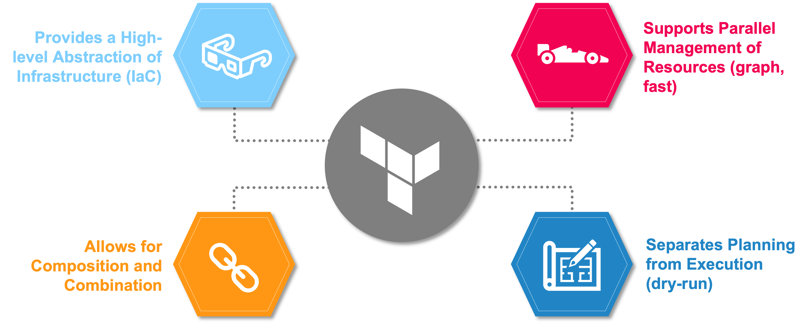

# Lab: Terraform's Purpose

## Terraform Goals

- Unify the view of resources using infrastructure as code
- Support the modern data center (IaaS, PaaS, SaaS)
- Expose a way for individuals and teams to safely and predictably change infrastructure
- Provide a workflow that is technology agnostic
- Manage anything with an API

## Terraform Benefits

- Provides a high-level abstraction of infrastructure (IaC)
- Allows for composition and combination
- Supports parallel management of resources (graph, fast)
- Separates planning from execution (dry-run)

